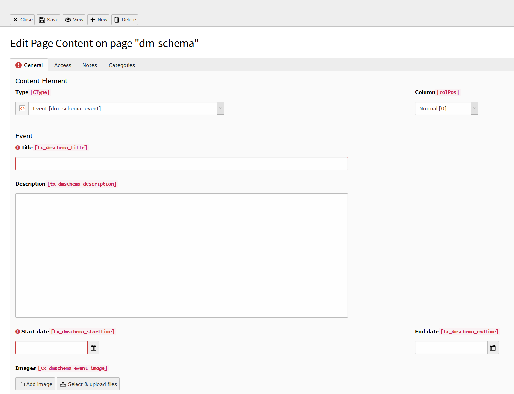

.. include:: ../../../Includes.txt

.. index:: Event

.. _event:

===========
The event element
===========

what does this element do, which fields are there, screenshot of the creation + of the output

+---------------------+-----------------------------------------------------------------------------------+
| Field                | Description  |      Requried                                                     |
+=====================+===================================================================================+
| WebPage             | This is the most generic type for a web page      | yes                           |
+---------------------+-----------------------------------------------------------------------------------+

   The backend view of a new event
