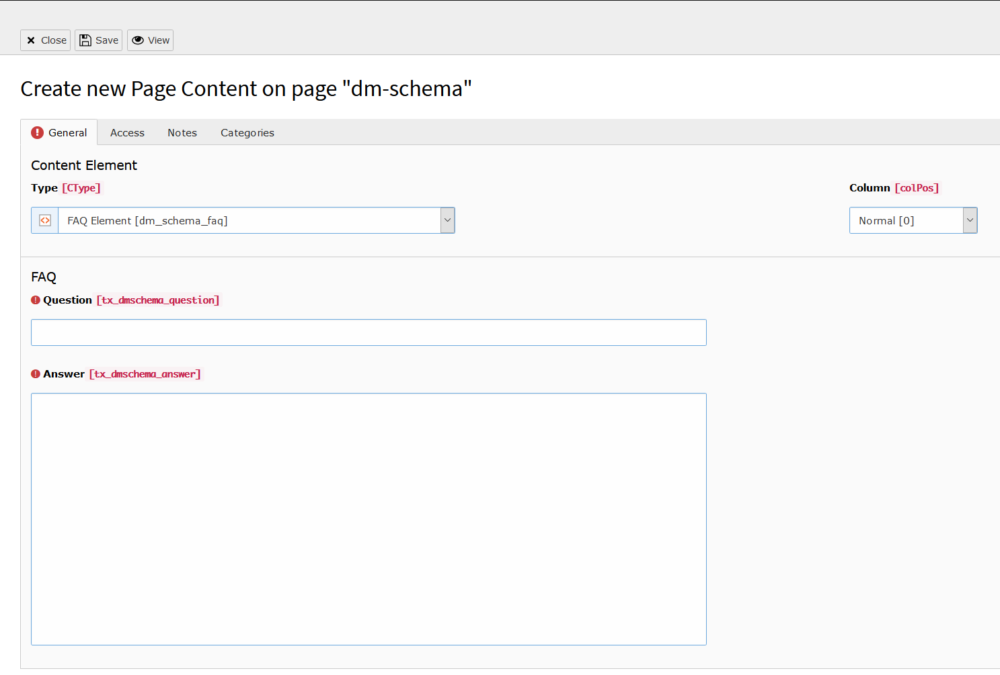

.. include:: ../../../Includes.txt

.. index:: FAQ

.. _faq:

===========
The faq element
===========

what does this element do, which fields are there, screenshot of the creation + of the output
note: do always set more then 1 faq.

+---------------------+-----------------------------------------------------------------------------------+
| Field                | Description  |      Requried                                                     |
+=====================+===================================================================================+
| Question             | This is the most generic type for a web page      | yes                           |
+---------------------+-----------------------------------------------------------------------------------+
| Answer             | This is the most generic type for a web page      | yes                           |
+---------------------+-----------------------------------------------------------------------------------+

   The backend view of a new faq
