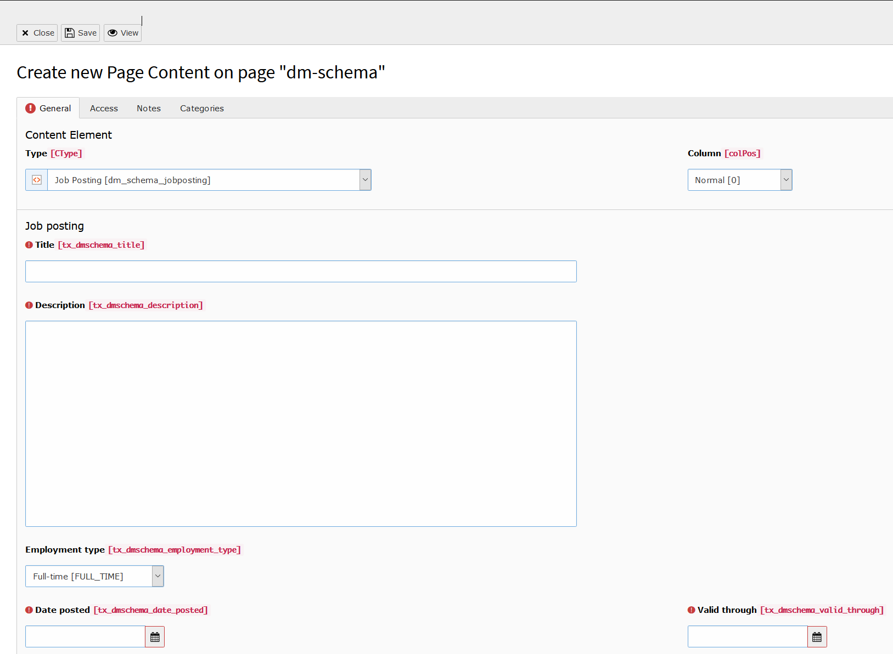

.. include:: ../../../Includes.txt

.. index:: JobPosting

.. _job-posting:

===========
The job posting element
===========

This element is a representation of a job posting element.
more information: `developers.google.com <https://developers.google.com/search/docs/data-types/job-posting>`__

.. note::

   the page type must be webpage

   The backend view of a new job posting

Available fields
===========

+---------------------------+-------------------------------------------------------------------------------------------------------------------------------------------------------------------+-----------+
| Field                     | Description                                                                                                                                                       | Requried  |
+===========================+===================================================================================================================================================================+===========+
| Title                     | The title of the job (not the title of the posting).                                                                                                              | yes       |
+---------------------------+-------------------------------------------------------------------------------------------------------------------------------------------------------------------+-----------+
| Description               | The full description of the job in HTML format.                                                                                                                   | yes       |
+---------------------------+-------------------------------------------------------------------------------------------------------------------------------------------------------------------+-----------+
| Employment type           | Type of employment. Choose one or more of the following case-sensitive values: FULL_TIME, PART_TIME, CONTRACTOR, TEMPORARY, INTERN, VOLUNTEER, PER_DIEM, OTHER    | yes       |
+---------------------------+-------------------------------------------------------------------------------------------------------------------------------------------------------------------+-----------+
| Date posted               | The original date that employer posted the job in ISO 8601 format                                                                                                 | yes       |
+---------------------------+-------------------------------------------------------------------------------------------------------------------------------------------------------------------+-----------+
| Valid through             | The date when the job posting will expire in ISO 8601 format                                                                                                      | yes       |
+---------------------------+-------------------------------------------------------------------------------------------------------------------------------------------------------------------+-----------+
| HiringOrganization name   | The organization offering the job position. This should be the name of the company (for example, "Starbucks, Inc"), and not the specific location that is hiring. | yes       |
+---------------------------+-------------------------------------------------------------------------------------------------------------------------------------------------------------------+-----------+
| HiringOrganization sameAs | URL of a reference Web page that unambiguously indicates the item's identity. E.g. the URL of the item's Wikipedia page, Wikidata entry, or official website.     | no        |
+---------------------------+-------------------------------------------------------------------------------------------------------------------------------------------------------------------+-----------+
| HiringOrganization logo   | An associated logo.                                                                                                                                               | no        |
+---------------------------+-------------------------------------------------------------------------------------------------------------------------------------------------------------------+-----------+
| Street address            | The street address.                                                                                                                                               | yes       |
+---------------------------+-------------------------------------------------------------------------------------------------------------------------------------------------------------------+-----------+
| Postal code               | The postal code.                                                                                                                                                  | yes       |
+---------------------------+-------------------------------------------------------------------------------------------------------------------------------------------------------------------+-----------+
| Address locality          | The locality in which the street address is, and which is in the region.                                                                                          | yes       |
+---------------------------+-------------------------------------------------------------------------------------------------------------------------------------------------------------------+-----------+
| Address region            | The region in which the locality is, and which is in the country.                                                                                                 | no        |
+---------------------------+-------------------------------------------------------------------------------------------------------------------------------------------------------------------+-----------+
| Address country           | The country. You can also provide the two-letter ISO 3166-1 alpha-2 country code.                                                                                 | yes       |
+---------------------------+-------------------------------------------------------------------------------------------------------------------------------------------------------------------+-----------+
| BaseSalary valueMin       | The lower value of some characteristic or property.                                                                                                               | yes       |
+---------------------------+-------------------------------------------------------------------------------------------------------------------------------------------------------------------+-----------+
| BaseSalary valueMax       | The upper value of some characteristic or property.                                                                                                               | no        |
+---------------------------+-------------------------------------------------------------------------------------------------------------------------------------------------------------------+-----------+
| BaseSalary valueUnit      | The QuantitativeValue, use one of the following case-sensitive values: HOUR, DAY, WEEK, MONTH, YEAR                                                               | yes       |
+---------------------------+-------------------------------------------------------------------------------------------------------------------------------------------------------------------+-----------+
| BaseSalary currency       | The currency in which the monetary amount is expressed. Use standard formats: ISO 4217 currency format.                                                           | yes       |
+---------------------------+-------------------------------------------------------------------------------------------------------------------------------------------------------------------+-----------+
