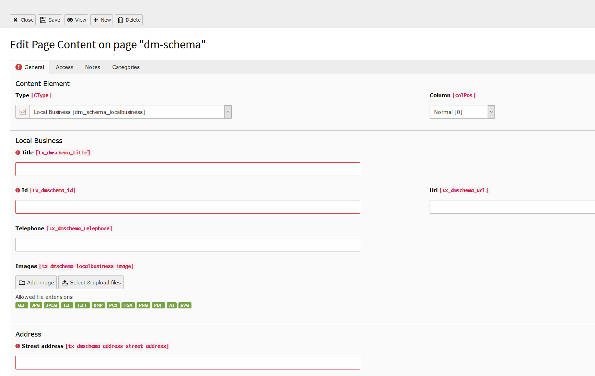

.. include:: ../../../Includes.txt

.. index:: LocalBusiness

.. _local-business:

===========
The local business element
===========

This element is a representation of an local business.
more information: `developers.google.com <https://developers.google.com/search/docs/data-types/local-business>`__

.. note::

   the page type must be webpage

   The backend view of a new local business

Available fields
===========

+------------------+-----------------------------------------------------------------------------------------------------------------------------------------------------------------------------------------------------------------------------------------------------------------------------------------------------------------+-----------+
| Field            | Description                                                                                                                                                                                                                                                                                                     | Requried  |
+==================+=================================================================================================================================================================================================================================================================================================================+===========+
| Title            | The name of the business.                                                                                                                                                                                                                                                                                       | yes       |
+------------------+-----------------------------------------------------------------------------------------------------------------------------------------------------------------------------------------------------------------------------------------------------------------------------------------------------------------+-----------+
| Id               | Globally unique ID of the specific business location in the form of a URL. The ID should be stable and unchanging over time. Google Search treats the URL as an opaque string and it does not have to be a working link. If the business has multiple locations, make sure the @id is unique for each location. | yes       |
+------------------+-----------------------------------------------------------------------------------------------------------------------------------------------------------------------------------------------------------------------------------------------------------------------------------------------------------------+-----------+
| Url              | The fully-qualified URL of the specific business location. Unlike the @id property, this URL property should be a working link.                                                                                                                                                                                 | no        |
+------------------+-----------------------------------------------------------------------------------------------------------------------------------------------------------------------------------------------------------------------------------------------------------------------------------------------------------------+-----------+
| Telephone        | A business phone number meant to be the primary contact method for customers. Be sure to include the country code and area code in the phone number.                                                                                                                                                            | no        |
+------------------+-----------------------------------------------------------------------------------------------------------------------------------------------------------------------------------------------------------------------------------------------------------------------------------------------------------------+-----------+
| Images           | URL of an image or logo for the event or tour. Including an image helps users understand and engage with your event. We recommend that images are 1920px wide (the minimum width is 720px).                                                                                                                     | no        |
+------------------+-----------------------------------------------------------------------------------------------------------------------------------------------------------------------------------------------------------------------------------------------------------------------------------------------------------------+-----------+
| Street address   | The street address.                                                                                                                                                                                                                                                                                             | yes       |
+------------------+-----------------------------------------------------------------------------------------------------------------------------------------------------------------------------------------------------------------------------------------------------------------------------------------------------------------+-----------+
| Postal code      | The postal code.                                                                                                                                                                                                                                                                                                | yes       |
+------------------+-----------------------------------------------------------------------------------------------------------------------------------------------------------------------------------------------------------------------------------------------------------------------------------------------------------------+-----------+
| Address locality | The locality in which the street address is, and which is in the region.                                                                                                                                                                                                                                        | yes       |
+------------------+-----------------------------------------------------------------------------------------------------------------------------------------------------------------------------------------------------------------------------------------------------------------------------------------------------------------+-----------+
| Address region   | The region in which the locality is, and which is in the country.                                                                                                                                                                                                                                               | no        |
+------------------+-----------------------------------------------------------------------------------------------------------------------------------------------------------------------------------------------------------------------------------------------------------------------------------------------------------------+-----------+
| Address country  | The country. You can also provide the two-letter ISO 3166-1 alpha-2 country code.                                                                                                                                                                                                                               | yes       |
+------------------+-----------------------------------------------------------------------------------------------------------------------------------------------------------------------------------------------------------------------------------------------------------------------------------------------------------------+-----------+
| Geo latitude     | The latitude of the business location. The precision should be at least 5 decimal places.                                                                                                                                                                                                                       | no        |
+------------------+-----------------------------------------------------------------------------------------------------------------------------------------------------------------------------------------------------------------------------------------------------------------------------------------------------------------+-----------+
| Geo longitude    | The longitude of the business location. The precision should be at least 5 decimal places.                                                                                                                                                                                                                      | no        |
+------------------+-----------------------------------------------------------------------------------------------------------------------------------------------------------------------------------------------------------------------------------------------------------------------------------------------------------------+-----------+
