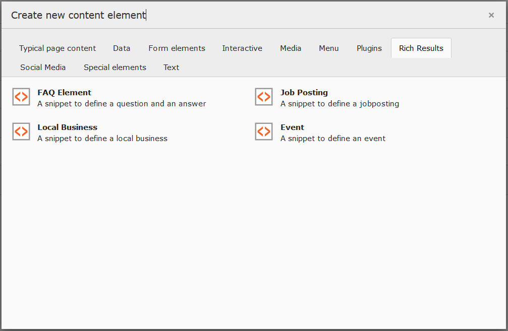

.. include:: ../Includes.txt

.. _for-editors:

===========
For Editors
===========

The website type is still configured in the page properties.

After the installation you now have new content elements available.
In the new tab 'Rich Results' you will now find the following new content elements as a kick-start:

* :ref:`Event <event>`
* :ref:`FAQ <faq>`
* :ref:`Job posting <job-posting>`
* :ref:`Local business <local-business>`

.. warning::
    These example elements do not produce any front end output. They are only used to generate the json-ld script block.

You can expand the content elements or create new ones.
How you expand the content elements by e.g. to have a front end edition, see :ref:`here <templating>`.
If you as a developer would like to create your own content elements, stop by :ref:`here <developer>`.
